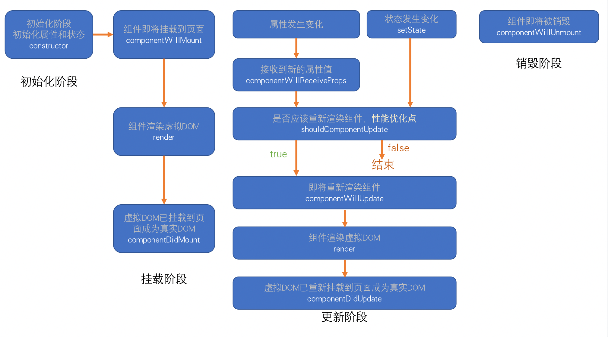
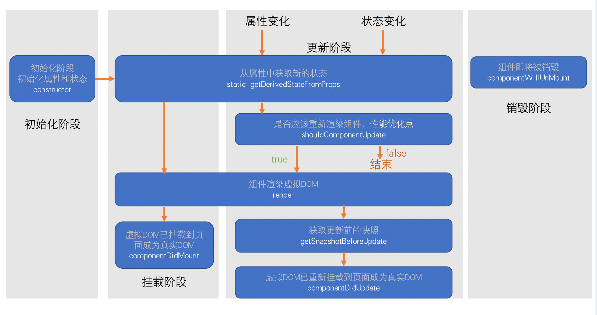

# 生命周期

生命周期：组件从诞生到销毁会经历一系列的过程，该过程就叫做生命周期。React在组件的声明周期中提供了一系列的钩子函数（类似于事件），可以让开发者在函数中注入代码，这些代码会在适当的时候运行。

**生命周期仅存在于类组件中，函数组件每次调用就是重新运行函数，旧的组件即刻被销毁**

## 旧版生命周期（16.0.0之前的版本）

- 按执行顺序排序
1. constructor 
    1. 同一个组件对象只会创建一次
    2. 不能在第一次挂载到页面之前，调用setState，为了避免问题，构造函数中禁止使用setState。
2. componentWillMount
    1. 组件即将被挂载，正常情况下只会运行一次
    2. 可以使用setState，但是为了避免bug，不允许使用。（因为在某些特殊情况下，该函数可能被调用多次）
3. render
    1. 返回一个虚拟DOM，会被挂载到虚拟DOM树中，最终渲染到页面的真实DOM中
    2. render可能不止运行一次，只要需要重新渲染，就会重新运行
    3. 严谨使用setState，会无限递归。
4. componentDidMount 
    1. 挂载完成，只会执行一次
    2. 通常情况下，会将网络请求/启动计时器等一开始需要的操作，书写到该函数当中
5. 组件进入活跃状态
6. componentWillReceiveProps
    1. 属性变化时会执行该函数，该函数可能会导致bug，不推荐使用
7. shouldComponentUpdate
    1. 指示React是否要重新渲染该组件，通过返回true和false来指定
    2. 默认情况下，会直接返回true
8. componentWillUpdate
    1. 组件即将被重新渲染
9. componentDidUpdate
    1. 往往在该函数中使用dom操作，改变元素
10. componentWillUnmount
    1. 组件销毁,通常在该函数中销毁一些组件依赖的资源，比如计时器。

## 新版生命周期

1. constructor 
    1. 同一个组件对象只会创建一次
    2. 不能在第一次挂载到页面之前，调用setState，为了避免问题，构造函数中禁止使用setState
2. static getDerivedStateFromProps
    1. 从属性中获取新的状态
    2. 一开始渲染会执行该函数，属性或状态改变也会执行该函数，该函数是静态方法。
3. render
    1. 返回一个虚拟DOM，会被挂载到虚拟DOM树中，最终渲染到页面的真实DOM中
    2. render可能不止运行一次，只要需要重新渲染，就会重新运行
    3. 严谨使用setState，会无限递归。
4. componentDidMount
    1. 虚拟DOM已挂载到页面成为真实DOM
5. shouldComponentUpdate
    1. 指示React是否要重新渲染该组件，通过返回true和false来指定
    2. 默认情况下，会直接返回true
6. getSnapshotBeforeUpdate
    1. 获取更新前的快照
7. componentDidUpdate
    1. 虚拟DOM已重新挂载到页面成为真实DOM
8. componentWillUnmount
    1. 组件销毁,通常在该函数中销毁一些组件依赖的资源，比如计时器。

